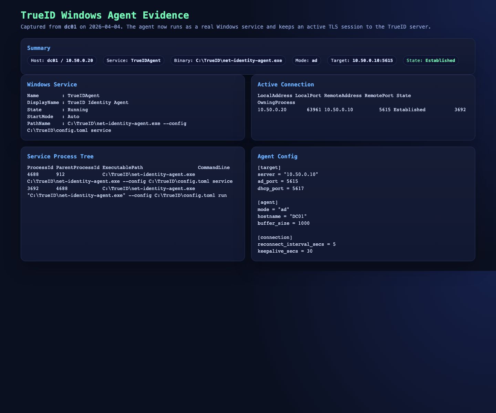
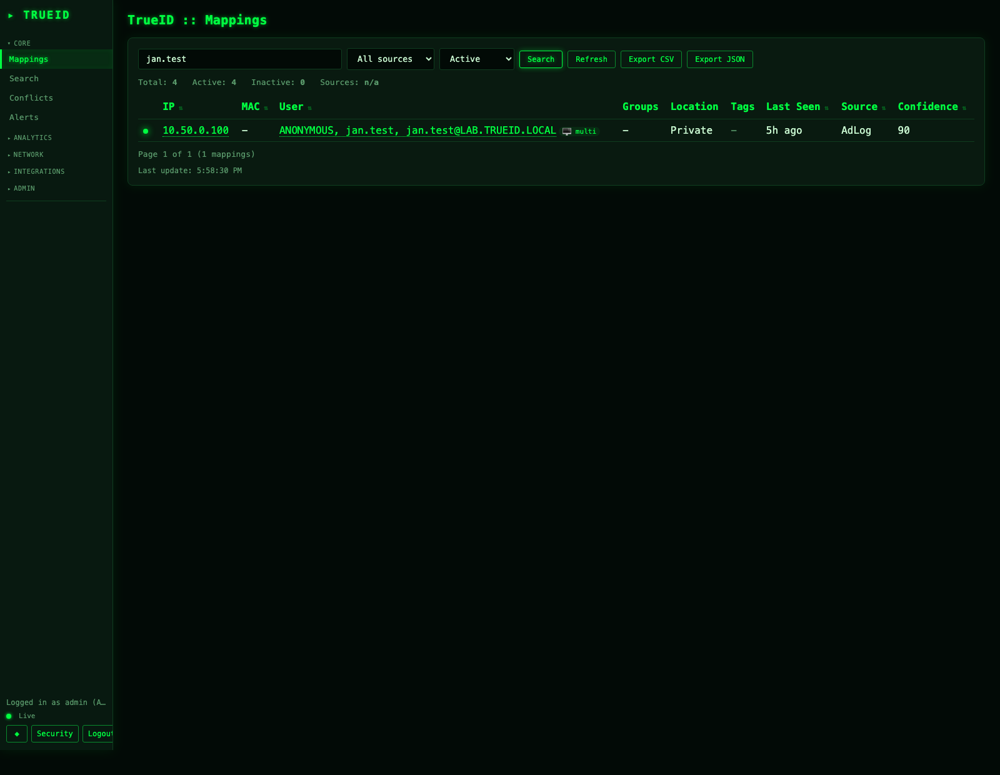

# TrueID Lab Validation Report — 2026-04-03

 ## Scope

This report summarizes the end-to-end lab validation performed against the following path:

1. Windows AD events generated on the source host.
2. TrueID Agent forwarding events over TLS to TrueID.
3. TrueID correlating the source IP with the user identity.
4. Sycope resolving the same IP to the same user through lookup enrichment.

The validated user/IP pair in the lab was:

- `jan.test`
- `10.50.0.100`

## End Result

The main integration path worked after targeted fixes:

- The Windows TrueID Agent now runs as a real Windows service on the DC.
- TrueID created a live mapping for `jan.test` on `10.50.0.100`.
- Sycope lookup enrichment resolved the same IP to `jan.test`.
- A saved Sycope dashboard/widget showed the enriched username without manual NQL input.

Evidence:

- 
- 
- 

## What Worked

- TrueID TLS ingestion on the AD listener worked once certificates and audit policy were in place.
- The agent correctly extracted AD logon information from Windows Event Log and sent it to TrueID.
- TrueID search and mapping views exposed the expected `jan.test` identity for `10.50.0.100`.
- Sycope lookup synchronization worked once the connector used the correct TrueID API contract.
- A dedicated Sycope dashboard/widget displayed the enriched username in a stable way.

## Problems Found and Required Fixes

### 1. Windows service installation was broken

**Symptom**

- `install` created a Windows service entry, but the registered command pointed to `service`.
- The agent binary did not actually support the `service` subcommand.
- Running the registered mode manually returned `unrecognized subcommand 'service'`.

**Impact**

- The agent could not be deployed as a real Windows service.
- The only working mode was a manual foreground process, which is not acceptable for production.

**Fix applied**

- Added a hidden `Service` subcommand in [`crates/agent/src/main.rs`](../crates/agent/src/main.rs).
- Reworked service registration and SCM runtime in [`crates/agent/src/service.rs`](../crates/agent/src/service.rs).
- `install` now registers `--config <path> service`.
- The SCM entry point now starts a child `run` process and keeps service state synchronized with Windows.

**Repository follow-up required**

- Add a Windows smoke test that verifies the binary accepts `service` and that `install` registers `--config <path> service`.
- Document the expected dual-process model for service mode.

### 2. Sycope connector used the wrong TrueID API authentication and response shape

**Symptom**

- The connector used `Authorization: Bearer ...` while TrueID API key auth expects `X-API-Key`.
- The connector assumed a raw JSON list, while the API may return an envelope with `data`.

**Impact**

- Sync could fail completely or return empty results even when TrueID already had valid mappings.

**Fix applied**

- Updated API auth and response handling in [`integrations/sycope/trueid_api.py`](../integrations/sycope/trueid_api.py).

**Repository follow-up required**

- Add connector smoke tests for `/api/v1/mappings` and `/api/v1/events`.
- Keep the connector aligned with the current TrueID API contract.

### 3. Sycope lookup could pick the wrong user

**Symptom**

- The connector originally used `current_users[0]`.
- In the validated mapping this could produce `ANONYMOUS` or a machine account instead of the interactive user.

**Impact**

- Sycope displayed the wrong identity even though TrueID already had the correct one.

**Fix applied**

- Added `select_lookup_user()` in [`integrations/sycope/trueid_sync.py`](../integrations/sycope/trueid_sync.py).
- The connector now prefers non-empty interactive identities and skips `ANONYMOUS` and machine-account entries when a better candidate exists.

**Repository follow-up required**

- Add unit tests for user selection rules, especially `ANONYMOUS`, `user@DOMAIN`, and machine-account cases.

### 4. Sycope NQL examples in the repo were incorrect for the validated appliance

**Symptom**

- The old example used a shorthand form that did not work on the tested Sycope build.

**Impact**

- The operator could have working enrichment in the backend and still see an empty or misleading table in Sycope.

**Fix applied**

- Updated the canonical NQL example in [`integrations/sycope/README.md`](../integrations/sycope/README.md).
- Updated the Sycope tab UI text in [`apps/web/assets/index.html`](../apps/web/assets/index.html).

**Repository follow-up required**

- Keep one canonical NQL example and reuse it everywhere.
- Add a saved widget/dashboard recipe to documentation instead of relying only on Raw Data table screenshots.

### 5. Sycope Custom Index flow is not portable enough to be enabled by default

**Symptom**

- The optional Pattern B installation flow did not match the validated Sycope appliance behavior.
- Custom index creation could not be completed as described in the original plan.

**Impact**

- First-time setup suggested an optional path that may fail on compatible-looking appliances.

**Fix applied**

- Documentation now marks Pattern B as optional and appliance-version dependent.
- Example configuration now starts with `enable_event_index=false`.

**Repository follow-up required**

- Keep lookup enrichment as the default path.
- Make Pattern B opt-in only after explicit validation on the target Sycope build.
- Ideally add version/capability detection before attempting Custom Index setup.

## What Was Not a Repository Bug

- `wincli-01` was Windows Home, so a normal domain join path was not available in the lab.
- A lab-side workaround was used to generate the required AD activity.
- This was an environment limitation, not a TrueID product defect.

## Documentation Gaps Closed

This revision updates the repo in the following areas:

- Added a dedicated lab validation report.
- Added screenshots for:
  - Windows service verification
  - TrueID mapping verification
  - Sycope dashboard verification
- Clarified Windows service behavior in [`docs/INTEGRATION_GUIDE.md`](INTEGRATION_GUIDE.md).
- Clarified that Sycope is an example integration and that Pattern B is optional in [`integrations/sycope/README.md`](../integrations/sycope/README.md).

## Recommended Next Repository Changes

These items should still be treated as backlog, even after the fixes already applied:

1. Add Windows-specific CI or at least a packaging smoke test for the agent service path.
2. Add automated connector tests covering API key auth, envelope parsing, and lookup user selection.
3. Treat Sycope Pattern B as experimental until appliance capability detection exists.
4. Add an explicit end-to-end validation checklist to release QA:
   - Windows service starts
   - TLS session is established
   - TrueID mapping appears
   - Sycope lookup resolves the same IP
   - Saved widget/dashboard renders the username

## Final Assessment

The core TrueID path is valid.

The main blocker was not correlation logic; it was deployment quality around the Windows
service path and the assumptions made by the Sycope example connector. After correcting
those points, the product behaved as expected in the lab.
