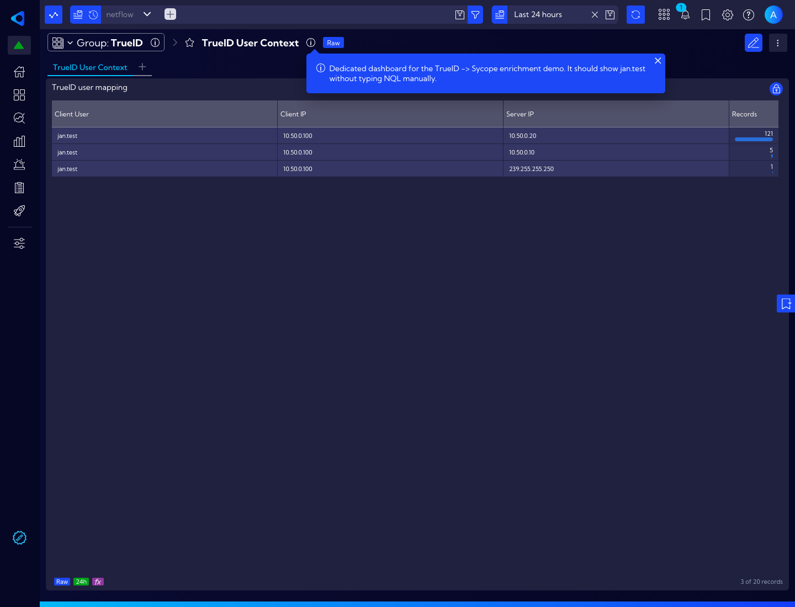

# TrueID → Sycope Example Integration

Synchronizes identity data from TrueID to Sycope for NetFlow enrichment.

> **Important:** This connector is a reference/example integration validated against a
> lab Sycope appliance. CSV Lookup enrichment was confirmed end-to-end. Custom Index
> injection is optional and appliance-version dependent.

## Architecture

```
TrueID (Rust/Axum, SQLite)
  → GET /api/v1/mappings
  → GET /api/v1/events?since=<ts>
    → trueid_sync.py
      → Sycope Lookup API (Pattern A: CSV Lookup merge)
      → Sycope Index API  (Pattern B: optional event injection)
```

| Pattern | Description | Sycope Target |
|---------|-------------|---------------|
| **A** — Lookup Enrichment | Active IP→identity mappings | CSV Lookup (`TrueID_Enrichment`) |
| **B** — Event History | Auth/mapping change events | Optional Custom Index (`trueid_events`) |

## Prerequisites

1. **TrueID** running with `trueid-web` on port 3000
2. **Sycope** >= 3.1 with:
   - User `trueid_sync` with role: "Edit Lookup values"
   - Add "Inject into custom indexes" only if you enable Pattern B
   - CSV Lookup `TrueID_Enrichment` created manually (columns: `ip, mac, user, hostname, vendor, last_seen`)
3. **Sycope SDK** (`sycope/` package) available at `../sycope/` relative to this directory
4. Start with **lookup-only mode**. Enable Pattern B only after validating that your Sycope build accepts custom index creation and event injection.

## Quick Start

```bash
# 1. Install dependencies
pip install -r requirements.txt

# 2. Edit config
cp config.json config.json.bak
vi config.json   # set trueid_host, sycope_host, sycope_login, sycope_pass

# 3. Keep Pattern B disabled for the first run
# enable_event_index=false

# 4. (Optional) Create Custom Index for Pattern B
# Only if your Sycope appliance supports this API flow
python3 install.py

# 5. Run sync
python3 trueid_sync.py
```

## Configuration

Edit `config.json`:

| Key | Description | Default |
|-----|-------------|---------|
| `trueid_host` | TrueID web URL | `http://localhost:3000` |
| `sycope_host` | Sycope appliance URL | `https://192.168.1.14` |
| `sycope_login` | Sycope API username | `trueid_sync` |
| `sycope_pass` | Sycope API password | — |
| `lookup_name` | CSV Lookup name in Sycope | `TrueID_Enrichment` |
| `enable_event_index` | Enable Pattern B | `false` |
| `index_name` | Custom Index name | `trueid_events` |

## Scheduling

The script runs **once per invocation** (no internal loop). Use a timer:

**systemd (recommended):**
```bash
sudo cp trueid-sycope-sync.{service,timer} /etc/systemd/system/
sudo systemctl enable --now trueid-sycope-sync.timer
```

**Docker:**
```bash
docker compose -f docker-compose.connector.yml up --build -d
```

## Validated Lab Outcome

The validated path in the lab was:

1. Windows AD events collected by the TrueID Agent.
2. TrueID mapping synchronized into Sycope lookup `TrueID_Enrichment`.
3. Sycope dashboard/widget resolved `clientIp=10.50.0.100` to `jan.test`.

Some Sycope builds do not expose derived lookup fields in the Raw Data column picker.
When that happens, create a saved widget/dashboard from the NQL query instead of relying
on the default table view.

Example dashboard output:



## NQL Usage

After sync, use the lookup in Sycope NQL queries:

```nql
src stream="netflow"
 | set clientUser=lookup("TrueID_Enrichment", "user", {"ip": clientIp}, default="")
 | set serverUser=lookup("TrueID_Enrichment", "user", {"ip": serverIp}, default="")
```

To focus on a single endpoint in Sycope, append a filter such as:

```nql
| where clientIp="10.50.0.100"
| sort timestamp desc
```

If your Sycope build supports `project`, you can pin the derived fields explicitly:

```nql
src stream="netflow"
 | set clientUser=lookup("TrueID_Enrichment", "user", {"ip": clientIp}, default="")
 | set serverUser=lookup("TrueID_Enrichment", "user", {"ip": serverIp}, default="")
 | project +clientUser, +serverUser
```

## Cleanup

```bash
python3 uninstall.py   # removes Custom Index (Pattern B data), if used
```
